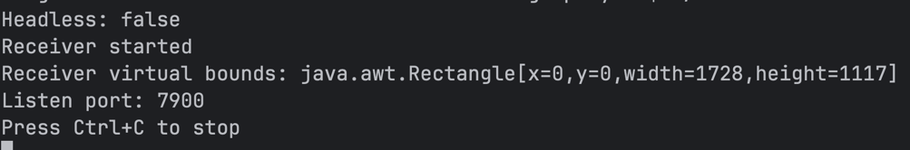

## Remote mouse control

This is project demonstrate how to control mouse on the remote computer

To run server use

```
./cli.sh server
```

If it needs to change port use parameter

```
./cli.sh server 7900
```



After success init server it's possible to connect via client like

```
./cli.sh client 192.168.0.109:7900
```

After success connection client can move mouse on the remote computer
