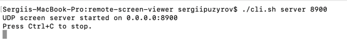
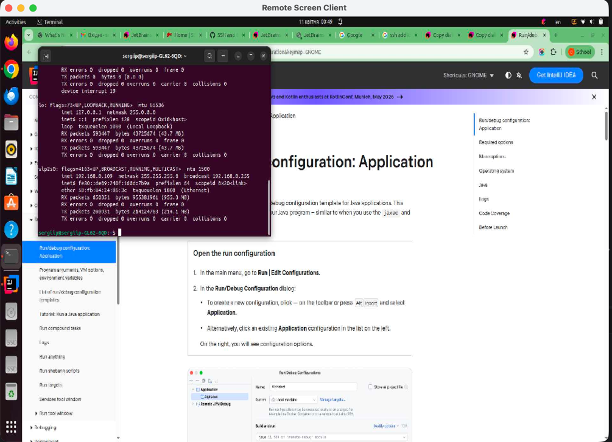
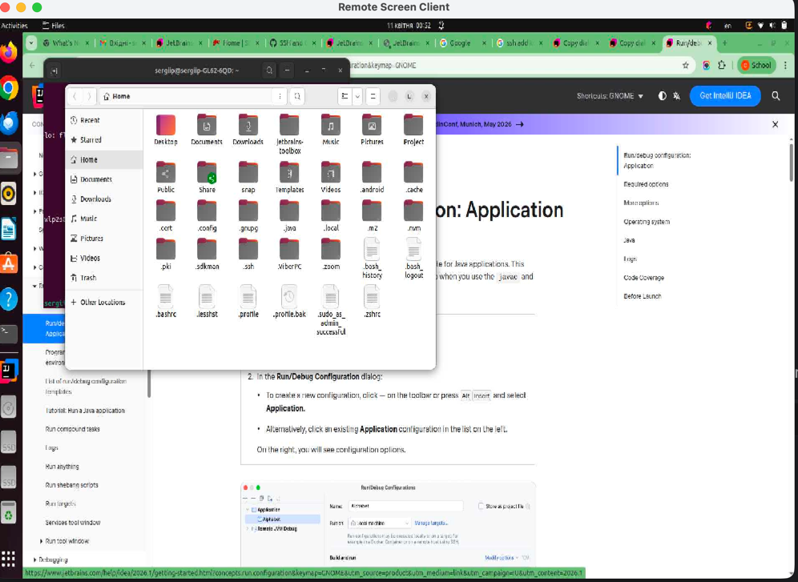

## Remote screen viewer

This is UDP application which contains UDP server and client

One instance of server can process multiple clients

To run server vi CLI use `cli.sh` script

```
./cli.sh server
```

By default, server would be run on the `7550` port.

To change server port pass it as parameter

```
./cli.sh server 8900
```
Here is the example console server running



Server send heart beat packets in defined interval. By default, it's 1000 millis.

But you can change it via the second parameter

```
./cli.sh server 8900 3000
```

After running the server it's possible to connect to it using screen client.

Screen client is based on Swing.

To run client need to define host and server port which should be the same as above

In local network it would be as

```
./cli.sh client 192.168.0.109 8900
```

And here you can see screen from the remote computer



And in the several change you can see updated screen



If server was shutdown that client would be closed in heart-beat interval timeout which is 180000 millis (3min) by default.

To change heart-beat timeout pass 3d parameter to run client script

```
./cli.sh client 192.168.0.109 8900 300000
```


